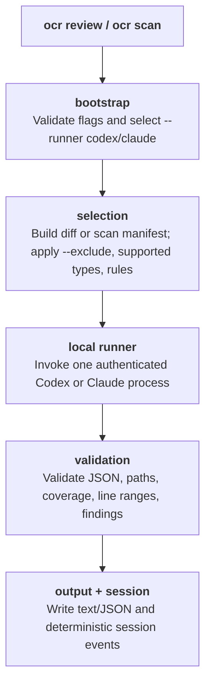

A walk-through of how `ocr review` and `ocr scan` run with the local runner model.

## High-level pipeline



OCR is the deterministic wrapper around an installed local CLI. It chooses the file set, renders the runner prompt, starts exactly one authenticated Codex or Claude runner process for that review or scan selection, validates the structured result, and writes reproducible output/session records.

Preview commands keep the same selection logic but stop before runner invocation. `ocr review --preview` is read-only and does not require `--runner` or runner authentication.

## Selection and preview

For `ocr review`, `internal/diff/git.go` loads one of three Git selections:

| Mode | Triggered by | Selection |
|---|---|---|
| Workspace | no range flags | staged, unstaged, and untracked changes |
| Commit | `--commit <sha>` | changes introduced by that commit |
| Range | `--from <a> --to <b>` | `merge-base(a, b)..b` |

For `ocr scan`, the selected scope comes from `--path` (or the repository when omitted). Both commands apply deterministic filters for binary files, user excludes, unsupported file types, built-in noisy paths, and rule matching before anything is sent to a runner.

The selected files become a manifest. That manifest is also the coverage contract: the runner response must report completed files in `reviewed_files`, and OCR records any missing coverage in the session output.

## Local runner invocation

Non-preview review and scan runs require a runner:

```bash
ocr review --runner codex
ocr scan --runner claude --path internal/agent
```

Supported values are `codex` and `claude`. OCR preflights the selected CLI before the run and fails early if it is missing; authentication failures are reported by the native runner command. Use `--runner-model <name>` only when you want to pass a model hint to the selected runner for this invocation.

OCR starts one local runner process per command invocation. Scope is controlled with selection flags, and duration is bounded by the process-level `--timeout <minutes>` flag.

The runner receives a read-only review prompt with the selected manifest, rules, background context, and required JSON schema. OCR expects structured JSON findings plus `reviewed_files`; it then validates paths and line ranges against the selected diff or file content before rendering.

## Sessions and resume

Every run writes append-only JSONL under:

```text
~/.opencodereview/sessions/<encoded-repo-path>/<session-id>.jsonl
```

Session events capture the deterministic selection, prompt metadata, runner result, validation warnings, coverage status, and final comments. `--resume <session-id>` reuses the saved session state so interrupted runs can continue with the same selection and coverage accounting.

## Output validation

Before output is shown, OCR checks that:

- every finding path belongs to the selected manifest;
- line ranges can be resolved for the selected diff or scanned file;
- comments match the required JSON shape;
- `reviewed_files` covers the expected manifest entries.

Text output is optimized for humans. `--format json` keeps machine-readable findings, warnings, coverage, and session metadata for CI and downstream tools.

## Telemetry

When telemetry is enabled, OCR emits pipeline-level spans for the command, diff/scan selection, runner invocation, validation, and output writing. Prompt and response content are not attached to telemetry. See [Telemetry](../telemetry/) for the current schema.

## Source-code map

| Concern | File |
|---|---|
| Top-level command dispatch | `cmd/opencodereview/main.go` |
| CLI flag parsing | `cmd/opencodereview/flags.go` |
| Review/scan orchestration | `internal/agent/` |
| File filter / preview | `internal/agent/preview.go` |
| Diff loading | `internal/diff/git.go` |
| Rule resolution | `internal/config/rules/system_rules.go` |
| Runner adapters | `internal/runner/` |
| Session JSONL writer | `internal/session/persist.go` |
| Web viewer | `internal/viewer/server.go` |

## See Also

- [Tools](../tools/) — runner selection, permissions, and customization boundaries.
- [Review Rules](../review-rules/) — how rule text is resolved.
- [Session Viewer](../viewer/) — inspect saved sessions.
